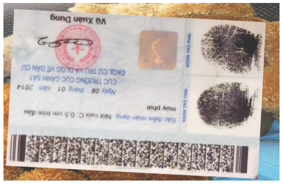

# ID Card Rotation Check

This model is used to check the degree of rotation in an image, typically checking for rotations of 90, 180, or 270 degrees.

## Multi rotation
This project focuses on rotating images in a dataset based on the number of classes. The rotation is performed in a range of 360 degrees: `classes[i] = int(360*i/num_classes)`.

Example:
- `num_classes = 2` results in `classes = ["0", "180"]`, meaning the images will be rotated either "0" or "180" degrees.
- `num_classes = 4` results in `classes = ["0", "90", "180", "270"]`.
- `num_classes = 8` results in `classes = ["0", "45", "90", "135", "180", "225", "270", "315"]`.


## Available Models

The following models are available for rotation detection:

- SimpleModel with Conv2d
- mobilenet_v3_small
- mobilenet_v3_large

## Augmentation
To increase the dataset, several methods are used:

- Rotate: Rotate the image by a small angle (10 degrees), only applicable for tasks involving large angle rotation.
- Expand: Expand the image by a certain margin and parse it on a background image
- Some augmentation functions from the Albumentations library.

   

## Installation
Install the required dependencies. It is recommended to set up a virtual environment:
```shell
    pip install -r requirements.txt
```

## Usage
1. Prepare the training data:
    - Place ID card images in the ./images folder.
    - Create a JSON file (data.json) in the following format:
    - Note: Since the model will automatically rotate the images based on the number of classes, the images in the dataset should be unrotated, meaning that the label for all the images should be "0". Example data: [id_card_not_rotate.zip](https://drive.google.com/file/d/1suO5nXOefQW1k5nF-Js1dOFndzmsis-J/view?usp=drive_link)

    ```json
    {
    "classes": ["0"],
    "samples": [
        {
            "image_path": "./images/cccd_chip_back_0000.jpg",
            "label": "0"
        },
        {
            "image_path": "./images/cccd_chip_back_0001.jpg",
            "label": "0"
        },
    ]
    }
    ```

2. Configure the training settings: Modify the configuration file (./config/train_config.yml) to specify the model, hyperparameters, and training options.


3. Train the model: Run the training script:
```shell
    python train.py
```


4. Test the model: image folder and weight path in train_config.yml. [weight](https://drive.google.com/drive/folders/1Vq7OzlVwTjkxw2t_dycA1Trga3kqDH7f?usp=drive_link)
```shell
    python inference.py
```
    
